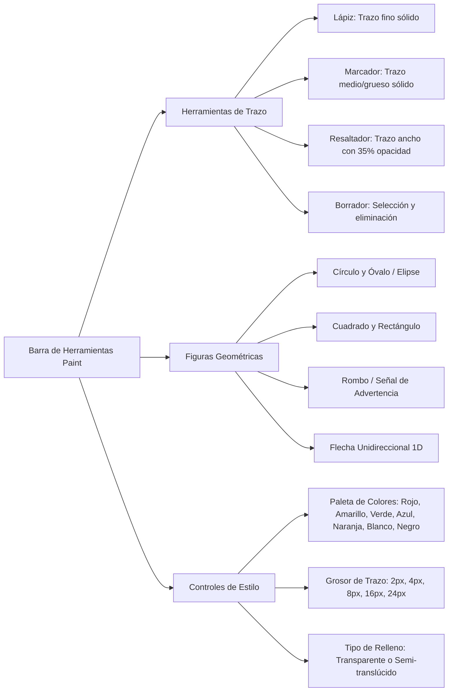

# SPEC-ADM-010: Edición de Imágenes con Canva, Nuevas Herramientas Tipo Paint y Expansión de Íconos Técnicos

## 1. Contexto y Justificación
Actualmente, el editor interactivo [`SecurityCanvasEditor`](file:///d:/projects/security-crm-frontend/src/components/security-studies/SecurityCanvasEditor.tsx) está enfocado en el plano satelital principal del estudio de seguridad (Mapbox), asociando coordenadas GPS a cada dispositivo y geocercas perimetrales.

Sin embargo, en las auditorías de seguridad física y electrónica en campo, los técnicos e ingenieros toman fotografías detalladas in situ (ej. cuartos de racks, accesos vehiculares, cercas vulneradas, postes perimetrales y tableros eléctricos). 
Para enriquecer los estudios, se requiere:
1. **Editar directamente cualquier fotografía adjunta tomada o subida por el usuario**, abriendo un lienzo gráfico Konva.js con la foto como fondo.
2. **Expandir la biblioteca de dispositivos técnicos** con simbología especializada (videovigilancia analítica, alarmas, gabinetes, UPS, switches, generadores, etc.).
3. **Incorporar una suite de dibujo y señalización libre estilo MS Paint** (lápiz, marcador, resaltador, figuras geométricas básicas, flechas 1D, selector de colores y grosores).

---

## 2. Requerimientos

### 2.1. Ajustes en Botones e Interfaz de Navegación
* **1.1. Canva Satelital:**
  - En la vista de lista de estudios de seguridad ([`security-studies/page.tsx`](file:///d:/projects/security-crm-frontend/src/app/(protected)/administrative/clients/[id]/security-studies/page.tsx)), renombrar el botón azul de la tarjeta del estudio de **"Abrir Canva"** a **"Canva Satelital"**, reforzando visual y conceptualmente al usuario que únicamente desde este acceso se gestiona la imagen satelital georreferenciada (con datos de latitud, longitud, geocercas perimetrales y Bounding Box).
  - Mantener el ícono de lápiz (`EditIcon`) para preservar la intuición de edición del plano principal.
* **1.2. Edición de Archivos Adjuntos:**
  - En el modal de **Documentos y Archivos Adjuntos del Estudio**, para todos los archivos cuyo `mimeType` sea una imagen (`image/jpeg`, `image/png`, `image/webp`, etc.):
  - Agregar un botón **"Editar con Canva"** ubicado inmediatamente a la izquierda del botón existente **"Abrir"**.
  - Al pulsar "Editar con Canva", abrir el editor interactivo cargando dicha fotografía como imagen base y recuperando su estado vectorial previo si ya fue editada.

---

### 2.2. Modo Anotación sobre Fotos Adjuntas (`mode="attachment_photo"`)
En [`SecurityCanvasEditor.tsx`](file:///d:/projects/security-crm-frontend/src/components/security-studies/SecurityCanvasEditor.tsx), introducir un nuevo modo de operación que desacople la dependencia de Mapbox y coordenadas GPS:
* **Relación de Aspecto y Dimensiones:** Se adapta a la imagen fotográfica cargada (preservando su ratio natural sin forzar 16:9 satelital estricto de Mapbox).
* **Controles Ocultos:**
  - Ocultar geocercas satelitales, cálculo de Bounding Box Mercator y opciones de aprobación de geofencing.
* **Controles Habilitados:**
  - Herramientas completas de dibujo libre y formas.
  - Librería expandida de íconos técnicos.
  - Guardado y autoguardado del estado vectorial de la foto en el backend.

---

### 2.3. Backend: Persistencia del `canvasState` en Archivos Adjuntos
El modelo [`SecurityStudy`](file:///d:/projects/security-crm-backend/prisma/schema/security_studies.prisma) almacena los archivos adjuntos en el campo `files: JsonB`.

* **Estructura enriquecida del archivo adjunto:**
  ```typescript
  export interface AttachedStudyFile {
    id: string;
    name: string;
    s3Key: string;
    mimeType: string;
    sizeBytes: number;
    fileType: string;
    uploadedAt: string;
    url?: string;
    canvasState?: PhotoCanvasState; // Estado vectorial de las anotaciones
  }
  ```

* **Nuevo Endpoint de Actualización:**
  - **Ruta:** `PATCH /administrative/security-studies/:id/files/:fileId/canvas`
  - **DTO (`UpdateFileCanvasDto`):**
    ```typescript
    export class UpdateFileCanvasDto {
      @IsNotEmpty()
      canvasState: Record<string, any>;
    }
    ```
  - **Seguridad:**
    - `@RequireFeature('sec_study')`
    - `@RequirePermissions('sec_study:update', 'sec_study:manage')`
  - **Lógica en Servicio:**
    - Busca el archivo con `id === fileId` dentro del array `study.files`.
    - Actualiza su propiedad `canvasState`.
    - Guarda en base de datos y retorna el archivo actualizado con su URL prefirmada.

---

### 2.4. Expansión de Biblioteca de Íconos Técnicos de Seguridad
Se agregarán 11 nuevos tipos de dispositivos/equipos, soportando el esquema de estado operativo (`EXISTING` 🟢, `DAMAGED` 🔴, `PLANNED` 🔵):

| Categoría | Clave (`type`) | Nombre Técnico | Descripción Visual / Simbología |
| :--- | :--- | :--- | :--- |
| **CCTV & Analítica** | `cam_analytics` | Cámara Video Analítica | Cámara con retícula o ícono de IA/algoritmo de análisis inteligente. |
| **CCTV & Analítica** | `cam_thermal` | Cámara Térmica | Cámara con símbolo de onda de calor / espectro térmico. |
| **CCTV & Analítica** | `dvr_nvr` | DVR / NVR | Unidad de grabación con bahías de discos y leds frontales. |
| **Alarmas** | `alarm_intrusion` | Alarma de Intrusión | Sensor PIR / detector de movimiento con ondas de detección volumétrica. |
| **Alarmas** | `alarm_emergency` | Alarma de Emergencia / Pánico | Estación manual de emergencia / pulsador de pánico / sirena estroboscópica. |
| **Control de Acceso**| `facial_panel` | Panel Reconocimiento Facial | Terminal biométrico vertical con pantalla y lector de rostro. |
| **Iluminación** | `led_post_light` | Luminaria LED en Poste | Luminaria de poste exterior con cono de iluminación descendente. |
| **Iluminación** | `led_floodlight` | Reflector Perimetral LED | Reflector de alta potencia con haz direccional de iluminación. |
| **Energía & Redes** | `electric_cabinet` | Gabinete Eléctrico | Tablero de distribución con interruptores termomagnéticos (tacos/fusibles). |
| **Energía & Redes** | `ups_backup` | UPS / Banco Baterías | Unidad de respaldo ininterrumpido de energía con ícono de batería/onda senoidal. |
| **Energía & Redes** | `network_switch` | Switch de Red / PoE | Switch ethernet para rack con puertos RJ45 y led de actividad. |
| **Energía & Redes** | `power_generator` | Generador Eléctrico | Grupo electrógeno motogenerador (Gas, Gasolina o Diésel). |

---

### 2.5. Herramientas de Dibujo y Geometría Libre (Tipo MS Paint)
Implementación en Konva.js de una barra de dibujo libre:



#### Detalles de Renderizado en Konva.js:
1. **Lápiz / Marcador (`Konva.Line`):**
   - Interpolación Bézier suave con `tension: 0.5`.
   - `lineCap: 'round'` y `lineJoin: 'round'`.
   - Lápiz: `strokeWidth: 3`, opacidad `1.0`.
   - Marcador: `strokeWidth: 8`, opacidad `1.0`.
2. **Resaltador (`Konva.Line`):**
   - `strokeWidth: 22`.
   - `opacity: 0.35` con `globalCompositeOperation: 'source-over'`.
   - Permite destacar cables, grietas o zonas críticas sin tapar la textura ni los detalles de la foto de fondo.
3. **Figuras Geométricas:**
   - **Rectángulo / Cuadrado:** `Konva.Rect` con coordenadas `x, y, width, height`. Si se presiona `Shift`, mantiene relación 1:1 (cuadrado).
   - **Círculo / Elipse:** `Konva.Ellipse` con `radiusX`, `radiusY`.
   - **Rombo:** `Konva.Line` con 4 vértices calculados `[cx, cy - h/2, cx + w/2, cy, cx, cy + h/2, cx - w/2, cy]`, `closed: true`.
4. **Flechas 1D (`Konva.Arrow`):**
   - Vector direccional con punta de flecha (`pointerLength: 14`, `pointerWidth: 12`).
   - Útil para indicar trayectorias de fuga, sentido de apertura de accesos o dirección visual de sensores.

---

### 2.6. Estructura de Datos de `PhotoCanvasState`
```typescript
export interface CanvasDrawingStroke {
  id: string;
  tool: 'pencil' | 'marker' | 'highlighter';
  color: string;
  strokeWidth: number;
  opacity: number;
  points: number[];
}

export interface CanvasShape {
  id: string;
  type: 'rectangle' | 'square' | 'circle' | 'ellipse' | 'rhombus' | 'arrow';
  x: number;
  y: number;
  width?: number;
  height?: number;
  radiusX?: number;
  radiusY?: number;
  points?: number[]; // Para flechas y rombos
  stroke: string;
  strokeWidth: number;
  fill?: string;
  opacity?: number;
}

export interface PhotoCanvasState {
  devices: CanvasDevice[];
  strokes: CanvasDrawingStroke[];
  shapes: CanvasShape[];
}
```

---

## 3. Criterios de Aceptación (CA)

* **CA1:** En la tarjeta de estudio de seguridad, el botón principal muestra la leyenda **"Canva Satelital"** con el ícono de lápiz.
* **CA2:** En el modal de adjuntos, cada archivo con formato de imagen muestra el botón **"Editar con Canva"** a la izquierda de "Abrir".
* **CA3:** Al hacer clic en "Editar con Canva", se abre el editor Konva en pantalla completa con la imagen adjunta como fondo, sin requerir mapa satelital ni geocercas GPS.
* **CA4:** El usuario puede seleccionar y dibujar con Lápiz, Marcador y Resaltador, cambiando entre diferentes colores y grosores.
* **CA5:** El resaltador mantiene una opacidad translúcida que permite ver la fotografía detrás de los trazos.
* **CA6:** El usuario puede insertar rectángulos, cuadrados, círculos, elipses, rombos y flechas unidireccionales sobre la foto.
* **CA7:** La paleta lateral incluye los 11 nuevos íconos técnicos (DVR, alarmas, cámaras analíticas/térmicas, biometría facial, gabinetes, UPS, switches, generadores, luminarias LED).
* **CA8:** Los nuevos íconos técnicos soportan cambio de estado operativo (`EXISTING`, `DAMAGED`, `PLANNED`) con sus respectivos colores normalizados.
* **CA9:** El endpoint `PATCH /administrative/security-studies/:id/files/:fileId/canvas` guarda y persiste el estado de las anotaciones en la base de datos de manera independiente para cada fotografía.
* **CA10:** Al volver a abrir "Editar con Canva" en una foto previamente anotada, todos los dibujos, formas e íconos se restauran exactamente en sus posiciones originales.

---

## 4. Archivos Impactados

### Backend:
* `src/modules/administrative/security-studies/dtos/update-file-canvas.dto.ts` *(Nuevo)*: DTO para validar el payload de anotaciones.
* `src/modules/administrative/security-studies/controllers/security-studies.controller.ts`: Endpoint `PATCH :id/files/:fileId/canvas`.
* `src/modules/administrative/security-studies/services/security-studies.service.ts`: Lógica para buscar el archivo en `study.files` y actualizar su `canvasState`.
* Pruebas unitarias correspondientes en `.spec.ts`.

### Frontend:
* `src/app/(protected)/administrative/clients/[id]/security-studies/page.tsx`:
  - Renombrar botón a "Canva Satelital".
  - Agregar botón "Editar con Canva" en lista de adjuntos.
  - Orquestar apertura del modal de Canva para adjuntos.
* `src/components/security-studies/SecurityCanvasEditor.tsx`:
  - Soporte para `mode: 'satellite' | 'study' | 'attachment_photo'`.
  - Integración de herramientas Paint (`pencil`, `marker`, `highlighter`, formas geométricas, flechas).
  - Integración de los 11 nuevos íconos vectoriales de seguridad.
  - Barra flotante de selector de colores y grosores.
  - Autoguardado conectado al endpoint del archivo o del estudio principal según corresponda.

---

## 5. Fases de Ejecución

1. **Fase 1: Backend:**
   - Crear DTO `UpdateFileCanvasDto`.
   - Implementar método en `SecurityStudiesService` y endpoint en `SecurityStudiesController`.
   - Ejecutar pruebas unitarias automatizadas (`npm test`).
2. **Fase 2: Frontend - Navegación y UI:**
   - Renombrar a "Canva Satelital" en la tarjeta.
   - Añadir botón "Editar con Canva" en modal de archivos.
3. **Fase 3: Frontend - Biblioteca de Nuevos Íconos:**
   - Crear simbología SVG vectorial para los 11 nuevos equipos y registrarlos en la paleta.
4. **Fase 4: Frontend - Motor de Dibujo Libre Tipo Paint:**
   - Implementar capas de dibujo (`strokes` y `shapes`) con Konva.js.
   - Controles de color, grosor y tipos de trazo (Lápiz, Marcador, Resaltador, Formas, Flechas).
5. **Fase 5: Integración y Pruebas E2E:**
   - Validación de carga, edición, autoguardado y reapertura de imágenes anotadas.
