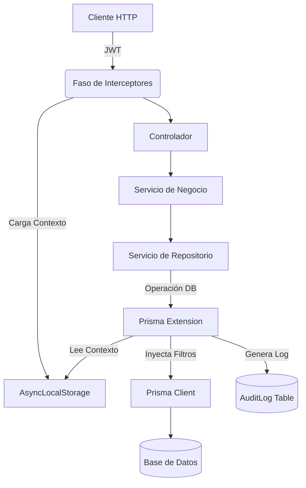

# Documentación de Arquitectura y Patrones de Diseño

Este documento describe la estructura técnica, los patrones de diseño y las decisiones arquitectónicas clave implementadas en el **Security CRM Backend**.

## 1. Estilo Arquitectónico: Monolito Modular

El proyecto sigue un enfoque de **Monolito Modular**. El código se organiza en módulos de dominio (`regulation`, `administrative`, `operation`) que agrupan lógica relacionada, facilitando una futura transición a microservicios si fuera necesario.

## 2. Capas de la Aplicación

Se implementa una arquitectura de capas clásica para separar responsabilidades:

- **Controladores (`.controller.ts`)**: Manejan las peticiones HTTP, validan la entrada básica y devuelven respuestas DTO. No contienen lógica de negocio.
- **Servicios de Aplicación (`.service.ts`)**: Orquestan la lógica de negocio, reglas de dominio y coordinan llamadas a repositorios.
- **Servicios de Repositorio (`.repository.service.ts`)**: Abstraen la complejidad de Prisma ORM. Proporcionan una interfaz limpia para el acceso a datos.

## 3. Patrones de Diseño Identificados

### 3.1. Repository Pattern

Utilizado para desacoplar la lógica de negocio del ORM (Prisma). Esto permite que los servicios no dependan directamente de la implementación de la base de datos, facilitando las pruebas unitarias.

### 3.2. DTO (Data Transfer Object)

Cada entrada y salida de la API está estrictamente definida por clases DTO con decoradores de `class-validator` y `nestjs/swagger`. Esto garantiza integridad de datos y documentación automática.

### 3.3. Singleton (NestJS Native)

La mayoría de los servicios (`@Injectable`) se manejan como Singletons por el contenedor de inversión de control (IoC) de NestJS.

### 3.4. Ambient Context (Contexto Ambiental)

Implementado mediante `AsyncLocalStorage` y `RequestContextService`. Permite que datos como el `tenantId` y `userId` "viajen" a través de llamadas asíncronas sin necesidad de pasarlos como parámetros en cada función.

### 3.5. Interceptor Pattern / AOP (Aspect-Oriented Programming)

Utilizamos Interceptores de NestJS para manejar tareas transversales:

- `AuditInterceptor`: Captura el contexto del usuario y activa el almacenamiento en `AsyncLocalStorage`.

## 4. Tecnologías y Extensiones de Vanguardia

### 4.1. Prisma Extensions (Patrón Interceptor/Proxy)

Es el "corazón" de la automatización del proyecto. Se ha desarrollado una extensión personalizada que actúa como un middleware de base de datos para:

- **Multitenencia Automatizada**: Inyecta filtros `where` y datos de creación de forma invisible para asegurar el aislamiento de datos.
- **Auditoría Invisible**: Detecta cambios en las entidades y genera registros en la tabla `AuditLog` automáticamente.

### 4.2. Inyección de Dependencias (DI)

Uso extensivo de DI para promover la modularidad y la facilidad de prueba, siguiendo los principios SOLID.

## 5. Seguridad y Aislamiento

- **Estrategia Bearer JWT**: Autenticación estándar para aplicaciones stateless.
- **RBAC (Role-Based Access Control)**: Implementado mediante `PermissionsGuard` y decoradores personalizados como `@RequirePermissions`.
- **Aislamiento de Datos**: Garantizado a nivel de base de datos por la extensión de Prisma, eliminando el riesgo de fuga de datos entre clientes (Tenants).

## 6. Diagrama de Flujo de Datos

---

_Este archivo se mantiene actualizado por el equipo de arquitectura para servir como guía a nuevos desarrolladores._
