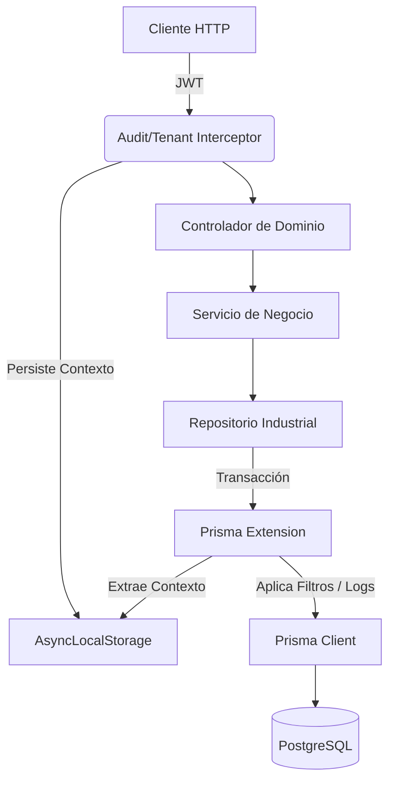

# Documentación de Arquitectura y Patrones de Diseño - Noxia API

Este documento describe la estructura técnica, los patrones de diseño y las decisiones arquitectónicas clave implementadas en el backend de **Noxia**.

## 1. Estilo Arquitectónico: Monolito Modular

El proyecto sigue un enfoque de **Monolito Modular**. El código se organiza en módulos de dominio que agrupan lógica relacionada:

- **`regulation`**: Gestión de empleados, departamentos, cargos y cumplimiento.
- **`operation`**: Módulo de Minuta (General, Parqueadero, Visitantes, Correspondencia).
- **`administrative`**: Gestión de recursos y procesos operativos.

## 2. Capas de la Aplicación

Se implementa una arquitectura de capas rigurosa para separar responsabilidades:

1.  **Directivas de API (Servicios/Controladores)**: Localizados en `src/modules`.
2.  **Capa Industrial de Repositorios**: Localizados en `src/common/repository`. Aquí se centraliza la interacción con Prisma, permitiendo que los módulos compartan lógica de persistencia de forma estandarizada.
3.  **Cross-Cutting Concerns**: Ubicados en `src/common` (Interceptores, Guardias, Contexto).

## 3. Patrones de Diseño Clave

### 3.1. Industrial Repository Pattern

Ubicado en `src/common/repository`. Abstrae la complejidad de Prisma ORM. Proporciona una interfaz limpia para el acceso a datos y permite la inyección de lógica transversal (como el filtrado por `tenantId`) de forma centralizada.

### 3.2. DTO (Data Transfer Object)

Garantiza que la API tenga un contrato claro. Ubicados en cada sub-módulo (ej. `src/modules/operation/minuta/dtos`).

### 3.3. Ambient Context & AsyncLocalStorage

Implementado en `src/common/context`. Permite que el `tenantId` y `userId` estén disponibles en cualquier parte de la cadena de ejecución sin necesidad de arrastrarlos como parámetros.

### 3.4. Prisma Extensions (Multitenancy & Auditoría)

Ubicado en `src/common/prisma-extension`. Es el motor de automatización que:

- **Inyecta filtros de Tenant** automáticamente en cada consulta.
- **Genera Audit Logs** de forma invisible al interceptar operaciones de escritura.

## 4. Estructura de Base de Datos Modular

Prisma está configurado para usar esquemas modulares en `prisma/schema`. Cada entidad tiene su propio archivo `.prisma`, facilitando la mantenibilidad y evitando un archivo de esquema gigantesco.

## 5. Diagrama de Arquitectura

---

_Noxia API - Engineering Document_
